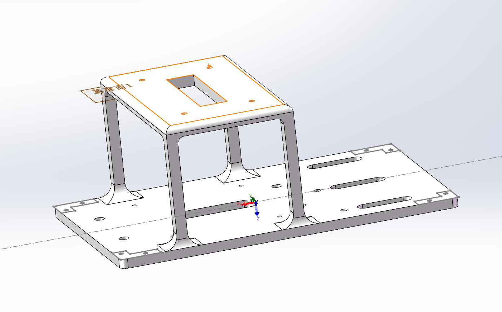
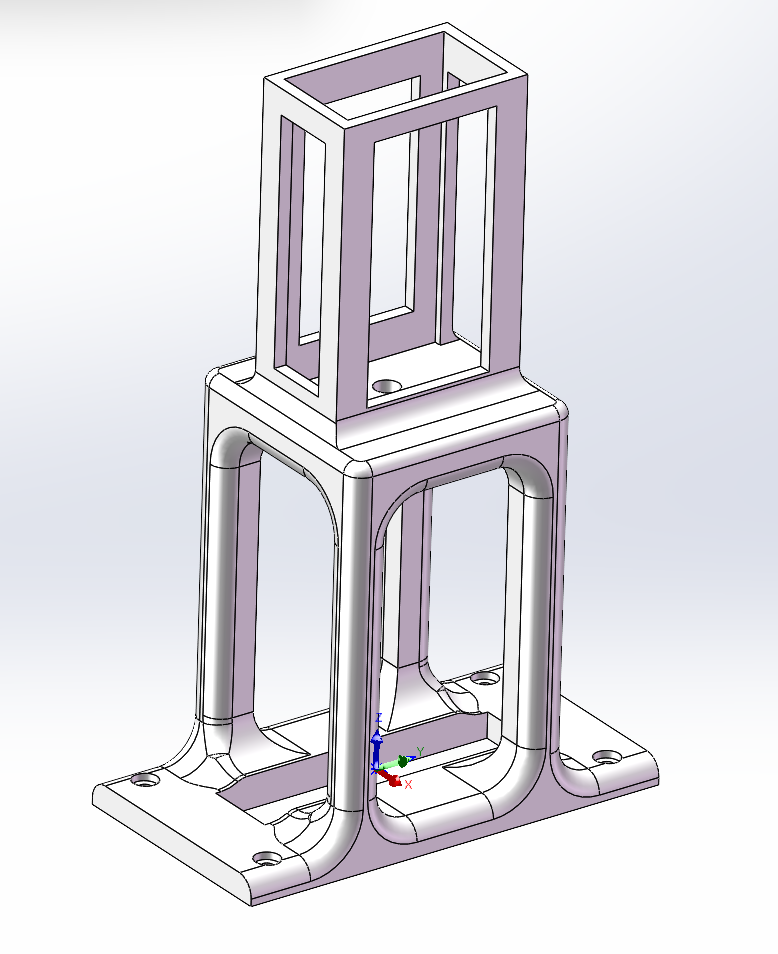
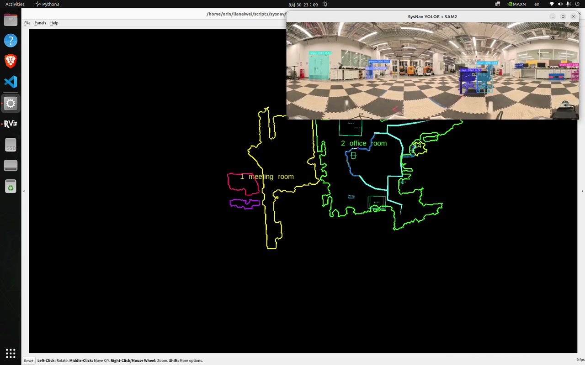
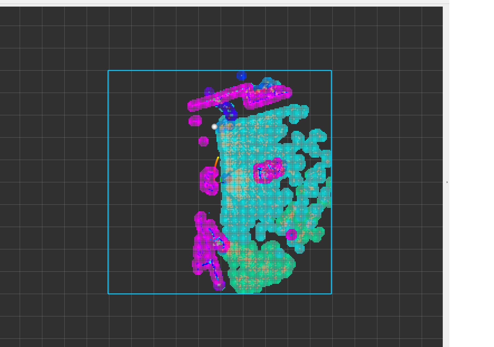
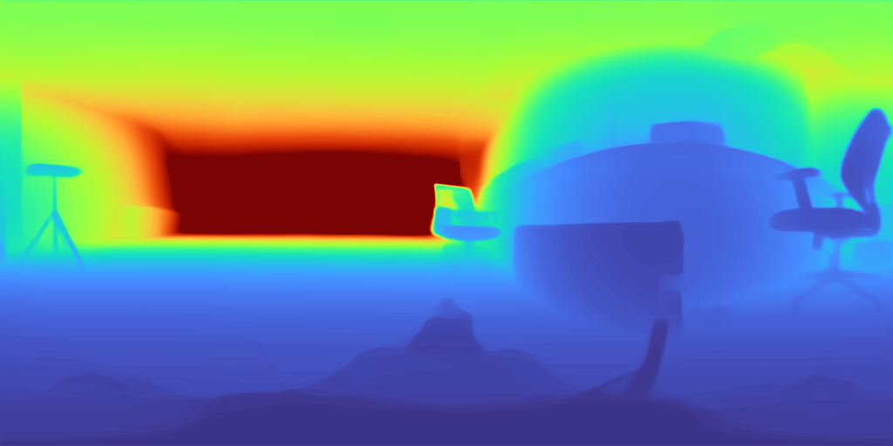
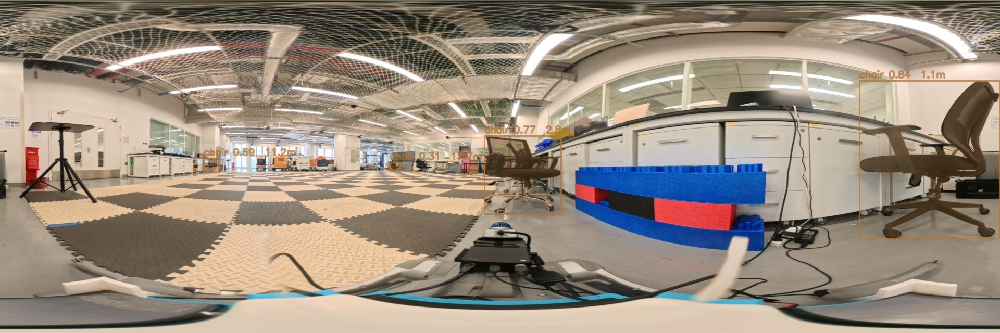
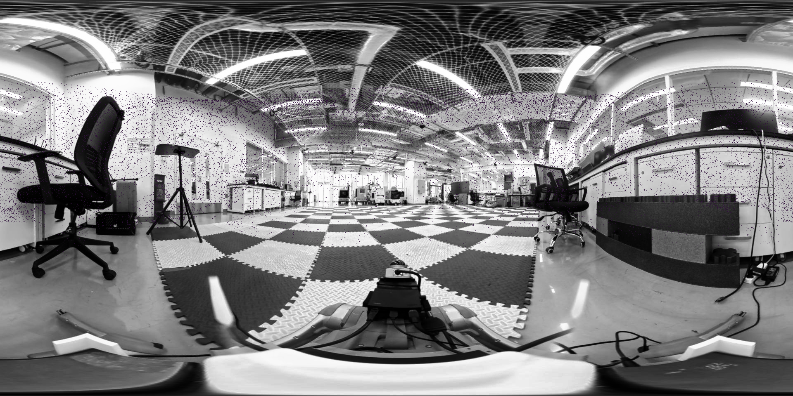
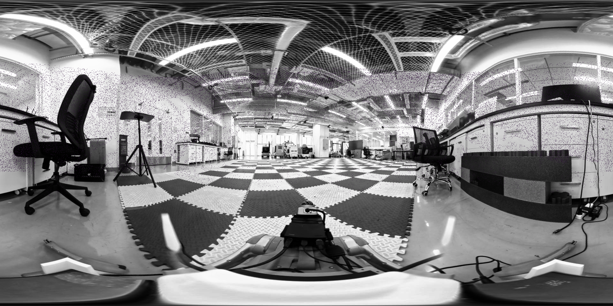

# IADC GO2 EDU Navigation Platform

  

  <strong>English</strong> · <a href="README_CN.md">中文</a>

This repository records the hardware and software integration work developed for a Unitree GO2 EDU navigation platform at HKUST(GZ). It combines a two-level Jetson/X5 payload structure with the scripts, ROS 2 package, validation tools, and upstream patches used during SysNav, LIO, SCAN-Planner, panoramic perception, depth, and tracking experiments.

The work is a derivative of the open-source [GO2-EDU Sensor Layout](https://github.com/zhechen003/GO2-EDU-sensor_layout) by `zhechen003`. The original license and upstream parts are retained. My additions and adaptations focus on the Jetson/power payload base and an elevated Insta360 X5 support rather than the original RealSense holder.

## Design Intent

- Provide a lower deck for a Jetson AGX Orin and leave usable space for an external battery or power accessories.
- Raise the Insta360 X5 above the onboard payload to reduce body occlusion in the equirectangular panorama.
- Use a standard 1/4-inch camera attachment at the top of the support.
- Preserve access to the Mid-360 and the modular quick-release structure used by the upstream platform.
- Keep editable SolidWorks parts and printable STL/3MF files together with the deployment record.

## Adapted Structure

The wider structure is the computing and power base. The taller structure is the panoramic-camera support mounted above it. This layout was developed for the SysNav and SCAN-Planner reproduction platform, where panoramic vision, LiDAR, and edge computing needed to coexist on the GO2 EDU.

## Files Added or Adapted in This Working Version

| File | Purpose |
| --- | --- |
| `BatteryHolder.SLDPRT` / `BatteryHolder.STL` | Rear battery or power-accessory restraint |
| `camera_support.SLDPRT` / `camera_support.STL` | Elevated support adapted for the Insta360 X5 |
| `backborad1.SLDPRT` / `backborad1.STL` | Payload base/backboard working version |
| `piece.SLDPRT` / `piece.STL` | Small auxiliary mounting piece |
| `BambooPrinting/backborad1.3mf` | Print-ready base-plate project |
| `assets/jetson-base-cad.png` | CAD record of the computing/power base |
| `assets/x5-camera-holder-cad.png` | CAD record of the elevated X5 support |

The repository also retains upstream GO2 head, Mid-360, RealSense, and quick-release parts so that the adapted files remain usable in context. Binary SolidWorks files may contain save-history or metadata changes in addition to geometry edits; use the screenshots and STL files to inspect the intended printable geometry.

## Research Use

This hardware supported the following engineering work:

- Unitree GO2 EDU sensor and Jetson integration;
- Insta360 X5 panoramic image acquisition;
- Mid-360 LiDAR and LIO experiments;
- SysNav simulation-to-platform integration;
- SCAN-Planner trajectory-generation tests;
- distributed panoramic depth and open-vocabulary perception experiments.

This repository documents a mechanical adaptation and deployment artifact. It does not claim authorship of the upstream GO2 sensor layout, SysNav, SCAN-Planner, or their algorithms.

## Software and Reproduction Record

The [`software`](software/) directory preserves the integration code that made the experiments repeatable:

- an Insta360 X5 UVC/GStreamer ROS 2 package;
- safe Go2, Mid-360, LIO, SCAN-Planner, and SysNav launch/diagnostic scripts;
- panoramic tracking, ReID, spherical-state recovery, and DAP client/server utilities;
- validation scripts and selected patches against upstream projects.

Many upstream systems were reproduced or adapted with limited algorithmic modification. They are credited with pinned source revisions in [`software/UPSTREAM_COMPONENTS.md`](software/UPSTREAM_COMPONENTS.md). Models, datasets, bags, credentials, and third-party source trees are not redistributed.

Selected server-side tracking metrics are preserved in [`experiments/tracking`](experiments/tracking/). The records include negative results and evaluation boundaries such as ground-truth initialization; raw datasets, model weights, internal logs, and server details remain outside the public repository.

## Experiment Records

| SysNav simulation | SCAN-Planner on the X5/Mid-360 platform |
| --- | --- |
|  |  |

| Panoramic depth | Open-vocabulary detections with depth |
| --- | --- |
|  |  |

| Raw Mid-360 projection | Projection after DAP consistency gating |
| --- | --- |
|  |  |

These images are deployment records rather than claims of new algorithms. The documented SCAN-Planner result is a planner-only trajectory preview; the chassis controller was not running in that capture.

## Detailed Work Log

The complete Chinese timeline, workspace/package explanation, completion boundaries, and handoff sequence are preserved in [`docs/WORKLOG_ZH.md`](docs/WORKLOG_ZH.md). An automatically generated inventory of 13 workspaces and 114 ROS packages is available in [`docs/jetson_ros_inventory_2026-09-20.json`](docs/jetson_ros_inventory_2026-09-20.json).

## Manufacturing Notes

- Inspect dimensions in SolidWorks before printing; this is a research working version rather than a commercial product.
- Check payload balance, screw engagement, cable clearance, camera visibility, and leg/body interference before operating the robot.
- Verify the top camera fastener against the actual Insta360 adapter. The intended interface is the standard 1/4-inch camera mount.
- Start with supervised, low-speed tests after any payload change.

## Attribution and License

Based on [zhechen003/GO2-EDU-sensor_layout](https://github.com/zhechen003/GO2-EDU-sensor_layout), which is licensed under the CERN Open Hardware Licence Version 2, Permissive. This derivative repository retains the original `LICENSE` and is distributed under the same license.

Adaptation and deployment record maintained by [Aiwei Lian](https://aliciasuiseiko.github.io/).
